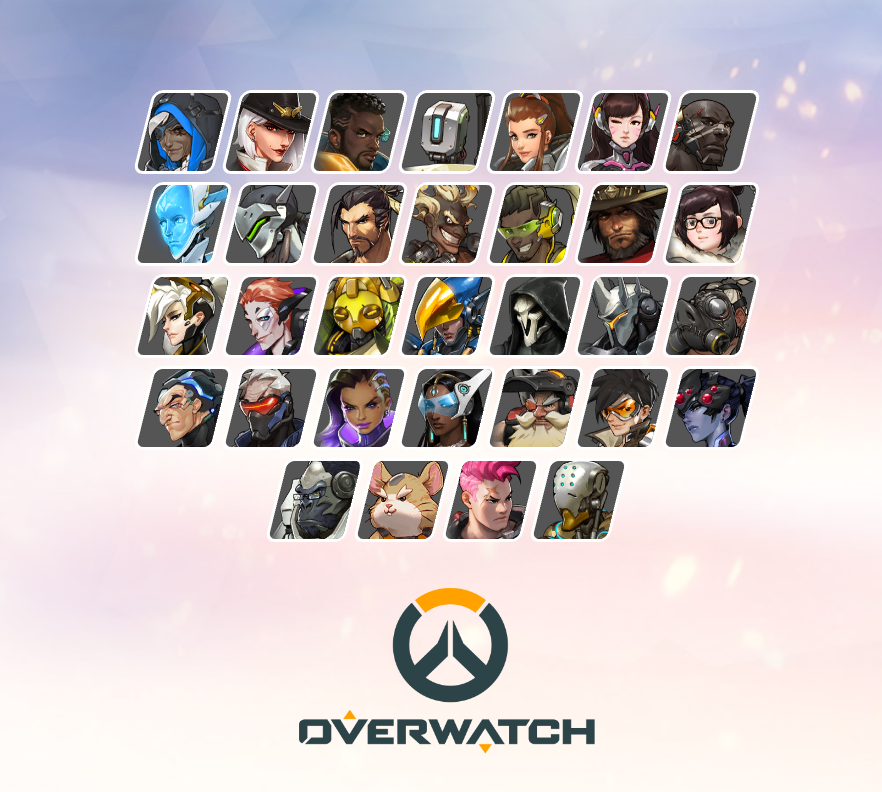

    

<h1>📝오버워치 히어로 셀렉터 </h1>
사용 기술 스택 
<ul>
<li></li>
<li></li>
</ul> 
<h2>✍ 프로젝트 UI</h2>

<h2>history</h2>
<ol>
<li>0826 - 마크업 , 스타일 적용</li>
<ul>
<li>최대한 많은 css 속성 부여</li>
<li>transform , transition , overflow ,background 관련 속성들 등등</li>
</ol>
</ol>
